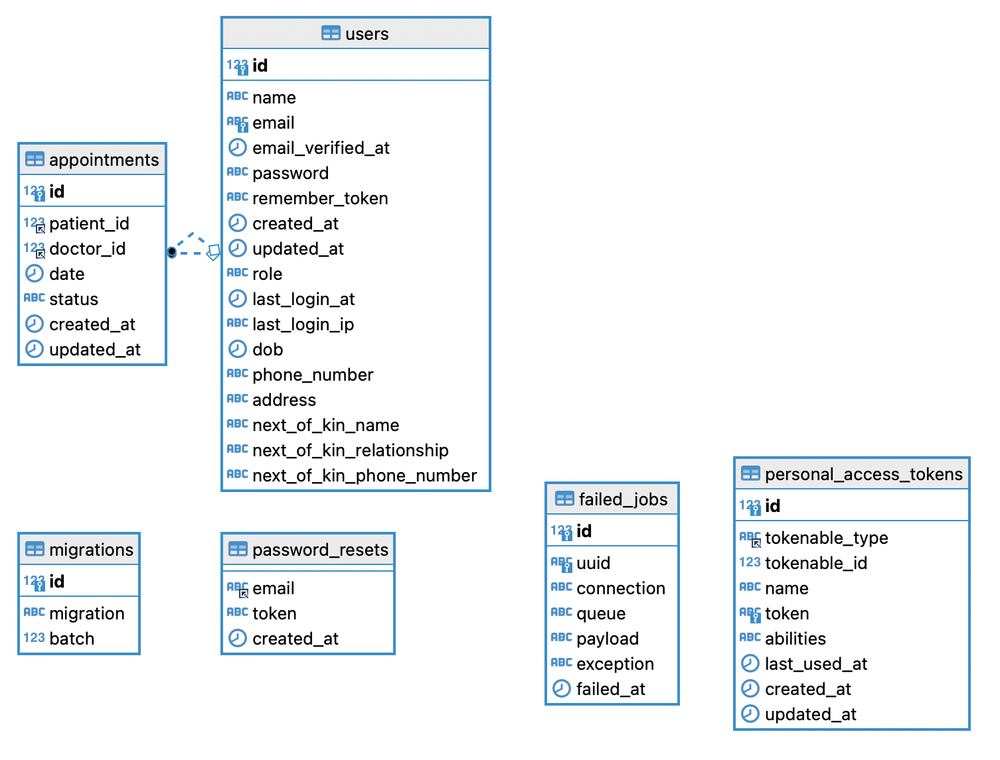

# Patient Management

- [Demo Site](http://patientmanagement21.herokuapp.com)

## Machine Requirement

- PHP 8.0 and greater
- node.js 
- Mysql 8 and greater

## Installation

### Step 1: Clone this repo to get started.

`git clone https://github.com/jasminetracey/patientmanagement`

### Step 2: Install Composer Dependencies

`composer install`

### Step 3: Install NPM Dependencies

`npm install && npm run dev`

### Step 4: Setup project

- Copy the .env.example file to .env

`cp .env.example .env`

- Update your .env file to connect to your local database.

- Generate your application keys

`php artisan key:generate`

- Run the Demo Seeder to get started with a few users

`php artisan migrate:fresh --seed`

- Start app

`php artisan serve`

### Step 5: To Run tests

`php artisan test`

## Database

